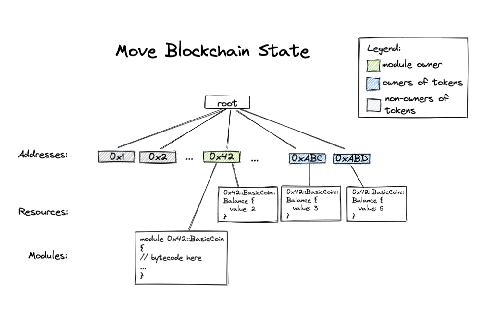
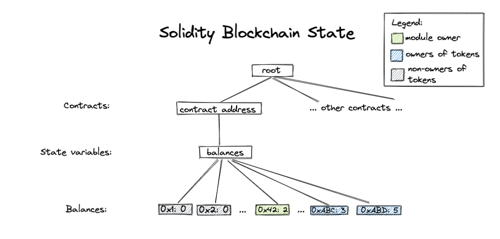

# move-hackathon-tutorial
Move tutorial for the hackathon happening on Dec 7-8

### Step 0
- Run the setup script to install Move CLI, Shuffle and dependencies:

```
$ sh step_0/setup.sh
```
- Include environment variable definitions in `~/.profile` by running this command:
```
$ . ~/.profile
```

Once this is done, you can alias the `move` package command to to `mpm`:

```bash
$ alias mpm = "<path_to_diem_repo>/target/debug/df-cli package"
$ alias shuffle = "<path_to_diem_repo>/target/debug/shuffle"
```

You can check that it is working by running `mpm -h`. You should see
something like this along with a list and description of a number of
commands:

```
move-package 0.1.0
Package and build system for Move code.

USAGE:
    move package [FLAGS] [OPTIONS] <SUBCOMMAND>
...
```

There is official Move support for VSCode, you can install this extension
by opening VSCode and searching for the "move-analyzer" package and
installing it. Detailed instructions can be found
[here](https://github.com/diem/diem/tree/main/language/move-analyzer/editors/code).

### Step 1: Write my first Move module

To create your first Move module, we first need to create a Move package by
calling

```
$ mpm new <pkg_name>
```

Now change directory into the package you just created

```
$ cd <pkg_name>
```

and look around. You should see a directory called `sources` -- this is the
place where all the Move code for this package will live[1]. You should
also see a `Move.toml` file which specifies dependencies and other
information about this package, we'll explore this in a bit. If you're
familiar with Rust and Cargo, the `Move.toml` file is similar to the
`Cargo.toml` file, and the `sources` directory similar to the `src`
directory.

Let's write some code! Open up `sources/FirstModule.move` in your
editor of choice.

Modules are the building block of Move code, and they always are defined
relative to a specific address -- the address that they can be published
under. So let's start out by defining our first module, and look at the
different parts:

```rust
module NamedAddr::Coin {
}
```

This is defining the module `Coin` that can be published under the [named
address](https://diem.github.io/move/address.html#named-addresses)
`NamedAddNamedAddr`. Named addresses are a way to parametrize the source
code, so that we can compile this module using different values for
`NamedAddr` to get different bytecode.

Let's now define and assign the named address `NamedAddr` the value `0xDEADBEEF`.
We can do this by opening the `Move.toml` in your favorite editor and adding the
following:

```
[addresses]
NamedAddr = "0xDEADBEEF"
```

Let's now see if it works!

```
$ mpm build
```

Let's now define a structure in this module to represent a `Coin` with a
given `value`:

```
module NamedAddr::Coin {
    struct Coin has key {
        value: u64,
    }
}
```

Structures in Move can be given different
[abilities](https://diem.github.io/move/abilities.html) that describe what
can be done with that type. There are four different abilities in Move:
* `copy`: Allows values of types with this ability to be copied.
* `drop`: Allows values of types with this ability to be popped/dropped.
* `store`: Allows values of types with this ability to exist inside a struct in global storage.
* `key`: Allows the type to serve as a key for global storage operations.

So in this module we are saying that the `Coin` struct can be used as a key
in global storage, and because it has no other abilites, it cannot be
copied, dropped, or stored as a non-key value in storage.

We can then add some functions to this module, functions are default
private, and can also be `public`, or `public(script)`. The latter states
that this function can be called from a transaction script.
`public(script)` functions can also be called by other `public(script)`
functions.

Let's check that it can build again

```
$ mpm build
```

Let's now add a function that mints coins and stores them under an
account:

```
module NamedAddr::Coin {
    struct Coin has key {
        value: u64,
    }

    public fun mint(account: signer, value: u64) {
        move_to(&account, Coin { value })
    }
}
```

Let's take a look at this function and what it's saying:
* It takes a [`signer`](https://diem.github.io/move/signer.html) -- an
  unforgeable token that represents control over a particular address, and
  a `value` to mint.
* It creates a `Coin` with the given value and stores it under the
  `account` using one of the [five different global storage
  operators](https://diem.github.io/move/global-storage-operators.html)
  `move_to`. This is where the `key` ability is imporant -- we couldn't
  call `move_to` on `Coin` unless it had the `key` ability!

Let's make sure it compiles now:

```
$ mpm build
```

### Step 2: Add unit tests to my first Move module

Now that we've written our first Move module, lets

#### Adding dependencies

#### Exercise?
* Implement withdraw and deposit and add tests for them

### Step 3: Design my ERC20 module

[ERC20 token standard](https://ethereum.org/en/developers/docs/standards/tokens/erc-20/) 
is one of the most important token standards on Ethereum. It introduces a standard for Fungible Tokens,
where each token is exactly the same as the other. Examples of such tokens include fiat currencies
like USD, Reddit Karma points, lottery tickets and so on. 

In this section, we are going to design the Move equivalent of an ERC20 token. ERC20 interface defines
the signatures of nine methods. We are going to include three of the most essential methods in our Move
contract:

```
function totalSupply() public view returns (uint256)
function balanceOf(address _owner) public view returns (uint256 balance)
function transferFrom(address _from, address _to, uint256 _value) public returns (bool success)
```

The signatures of the corresponding Move function are the following:

```
public fun total_supply(): u64 acquires TotalSupply;
public fun balance_of(owner: address): u64 acquires Balance;
public(script) fun transfer(from: signer, to: address, amount: u64) acquires Balance;
```
At the end of each function signature is an `acquires` list containing all the resources defined in this module accessed by the function.

Notice that `total_supply` and `balance_of` are public functions while `transfer` is a _public script_ function.
Similar to Ethereum, users submit signed transactions to Move-powered blockchains to update the blockchain state. 
We can invoke `transfer` method in a transaction script to modify the blockchain state. As mentioned in Step 1, only public script 
functions can be called from a transaction script. Therefore, we declare `transfer` as a public script function. 
And by requiring the `from` argument be a `signer` instead of an `address`, we require that the transfer transaction
must be signed by the `from` account.

Next we look at the data structs we need for this module. 

In most Ethereum contracts, the balance of each address is stored in a _state variable_ of type 
`mapping(address => uint256)`. This state variable is stored in the storage of a particular smart contract. In Move, however, storage
works differently. A Move module doesn't have its own storage. Instead, Move "global storage" (what we call our
blockchain state) is indexed by addresses. Under each address there are Move modules (code) and Move resources (values).

The global storage looks roughly like

```
struct GlobalStorage {
    resources: Map<address, Map<ResourceType, ResourceValue>>
    modules: Map<address, Map<ModuleName, ModuleBytecode>>
}
```

The Move resource storage under each address is a map from types to values. (An observant reader might observe that
this means each address can only have one value of each type.) This conveniently provides us a native mapping indexed
by addresses. In our ERC20 module, we define the following `Balance` resource representing the number of ERC20 tokens 
each address holds:

```
/// Struct representing the balance of each address.
struct Balance has key {
    coin: Coin // same Coin from Step 1
}
```

We also need a place to hold the total supply of the tokens. In Solidity, we would store this value in a state variable.
In our Move module, again we will have to store this value in a struct under some address. A reasonable place to put this 
struct would be under module owner's address. You will have a chance to implement this in Step 4.

```
/// Struct representing the total supply of tokens, 
/// stored under module owner's address
struct TotalSupply {
    supply: u64
}
```

Roughly the Move blockchain state should look like this:

In comparison, a Solidity blockchain state might look like this:


### Step 4: Implement my ERC20 module

We are going to develop our module in a Shuffle (a developer tool for Move) project directory. Running `shuffle new <path>` will create
a new Shuffle project directory at the given path. We have already created a Shuffle project directory for you called
`step_4`. You'll notice there are a lot of files pre-included for you in this directory. There will be another tutorial
dedicated to how Shuffle works and what these files are. For now, we will focus on `main/sources` folder inside `step_4`.

`sources` folder contains source code for all your Move modules, which all have `.move` suffix. `ERC20.move` lives inside this folder. In this
section, we will take a closer look at the implementation of ERC20 methods inside `ERC20.move`.

#### Method `initialize_erc20`

Unlike Solidity, Move doesn't have a built-in `constructor` method called at the instantiation of the smart contract. 
We can, however, define our own initializer that can only be called by the module owner. We enforce this using the  
assert statement:
```
assert!(Signer::address_of(&module_owner) == MODULE_OWNER, ENOT_MODULE_OWNER);
```
Assert statements in Move can be used in this way: `assert!(<predicate>, <abort_code>);`. This means that if the `<predicate>`
is false, then abort the transaction with `<abort_code>`. Here `MODULE_OWNER` and `ENOT_MODULE_OWNER` are both constants 
defined at the beginning of the module.

We then perform three steps in this order:
1. Publish an empty `Balance` resource under the module owner's address.
2. Deposit a coin with value `total_supply` to the newly created balance of the module owner.
3. Publish a `TotalSupply` resource under the module owner's address using `move_to`. This is a TODO you will fix later.

#### Method `total_supply`

In the previous method we looked at, we publish a resource representing total supply of the tokens. For this method, 
we want to read the value of this resource. We use `borrow_global` to index into global storage:
```
borrow_global<TotalSupply>(MODULE_OWNER).supply
                  ||            ||         ||
        type of the resource  address  field name
```

#### Method `balance_of`

Similar to `total_supply`, we use `borrow_global` to read from the global storage.
```
borrow_global<Balance>(owner).coin.value
```

#### Method `transfer`
This function withdraws tokens from `from`'s balance and deposits the tokens into `to`s balance. We take a closer look 
at `withdraw` helper function:
```
fun withdraw(addr: address, amount: u64) : Coin acquires Balance {
    let balance = balance_of(addr);
    assert!(balance >= amount, EINSUFFICIENT_BALANCE);
    let balance_ref = &mut borrow_global_mut<Balance>(addr).coin.value;
    *balance_ref = balance - amount;
    Coin { value: amount }
}
```
At the beginning of the method, we assert that the withdrawing account has enough balance. We then use `borrow_global_mut` 
to get a mutable reference to the global storage, and `&mut` is used to create a [mutable reference](https://diem.github.io/move/references.html) to a field of a 
struct. We then modify the balance through this mutable reference and return a new coin with the withdrawn amount. 
 

### Compiling our code using Shuffle

Now that we have implemented our ERC20 contract, let's try building it using Shuffle by running the following command 
in `step_4` folder:
```
$ shuffle build
```

### Exercises
There are two `TODO`s in our module, left as exercises for the reader:
- Implement `deposit` method.
- Finish implementing `initialize` method.

Solutions to these exercises can be found in `step_4_sol`.

**Bonus exercises**
- Are there any issues or security loopholes with this code?
- Is the initializer guaranteed to be called before anything else? If not, how can we 
change the code to provide this guarantee?

### Step 5: Add unit tests to my ERC20 module

### Step 6: Make my ERC20 module generic

## Advanced steps

### Step 7: Write formal specifications for my ERC20 module

### Step 8: Formally verify my ERC20 module using Move Prover


Footnotes
---------------------------------------------------------------------------
[1] Move code can also live a number of other places, but for more
information on that see the [documentation on Move
packages](https://diem.github.io/move/packages.html).

Notes (to be removed in final version):
---------------------------------------------------------------------------
* We should base things on the assumption that these steps will be run in
  the Diem repo at the end.
